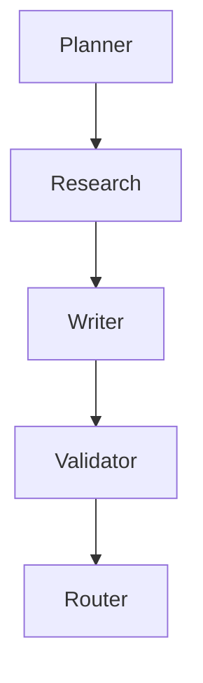

# AI Agent 從 PM 到 Architect

## Repository

ai-wordpress-factory

## Current Chapter

08 Validator

## Current Architecture



## Next

Supervisor

---

## Project Overview

AI WordPress Factory 是一個**自動化的 AI 驅動 WordPress內容生成和發布系統**，整合企業級 AI 代理人工作流程，提供結構化、可擴展的内容生成管道。

## Current Progress

### ✅ 已完成
- 核心 AI 代理人開發（Planner, Research, Writer, SEO, Reviewer, Validator）
- WordPress REST API 整合
- 工作流程狀態管理系統
- 基本配置管理
- 教材文檔架構建立（01-08 章節）
- 架構文檔創建（State, Workflow, Agent, Contract, Router）
- 術語詞彙集（Glossary.md）
- README 完整文檔

### 🚧 進行中
- 代理人智能協作機制
- 系統效能優化
- Router 代理人實現

### 📋 下一步
- **Supervisor 代理人開發**
- 多代理人協作流程優化
- 進階工作流程自定義
- 系統監控與日誌增強

## Architecture Components

### 核心模組
- **State**: 工作流程狀態管理
- **Agent**: AI 代理人模組
- **Workflow**: 工作流程協調
- **Contract**: 代理人合約定義
- **Router**: 任務路由與分配
- **Supervisor**: 代理人監督與協調（下一步）

### 代理人清單
1. **Planner** - 內容規劃代理人
2. **Research** - 智能調研代理人  
3. **Writer** - 專業撰寫代理人
4. **SEO** - 搜索引擎優化代理人
5. **Reviewer** - 內容審閱代理人
6. **Validator** - 資料驗證代理人
7. **Router** - 任務路由代理人
8. **Supervisor** - 代理人監督者（下一步）

## Learning Roadmap

### 第一層：基礎概念
- State - 狀態管理機制
- Dictionary - 專案術語集
- Function - 核心函數與工具
- Agent - AI 代理人基礎

### 第二層：核心模組
- Planner - 內容規劃
- Research - 智能調研
- Writer - 專業撰寫
- Validator - 資料驗證

### 第三層：進階主題
- Router - 任務路由
- Supervisor - 代理人監督
- 系統整合與部署

## Documentation Structure

```
ai-wordpress-factory/
├── COURSE_CONTEXT.md        # 本文件 - AI Context
├── README.md                # 完整專案文檔
│
├── docs/
│   ├── architecture/        # 架構文檔
│   │   ├── State.md
│   │   ├── Workflow.md
│   │   ├── Agent.md
│   │   ├── Contract.md
│   │   └── Router.md
│   │
│   ├── chapters/            # 教材章節
│   │   ├── 01-Agent.md
│   │   ├── 02-State.md
│   │   ├── 03-Dictionary.md
│   │   ├── 04-Function.md
│   │   ├── 05-Planner.md
│   │   ├── 06-Research.md
│   │   ├── 07-Writer.md
│   │   └── 08-Validator.md
│   │
│   └── glossary/            # 術語詞彙
│       └── Glossary.md
│
└── agents/                  # 代理人實作
    ├── planner.py
    ├── research.py
    ├── writer.py
    ├── seo.py
    ├── reviewer.py
    └── (待實作: validator.py, router.py, supervisor.py)
```

## For AI Assistants

### ChatGPT / Claude / Cursor / Copilot / NotebookLM

當您讀到此文件時，請了解：

1. **專案身分**：AI WordPress Factory - 企業級 AI 內容生成與發布系統
2. **當前階段**：正在實作 Validator 和 Router 代理人，準備開發 Supervisor
3. **架構特色**：模塊化、可擴展的 AI 代理人工作流程
4. **目標**：自動化WordPress內容生成，從規劃到發布的一鍵完成

### Context Keywords
- AI Agent, Workflow, State Management, WordPress REST API
- Planner, Research, Writer, Validator, Router, Supervisor
- Python, OpenAI API, Modular Architecture, Enterprise AI

---

**Last Updated**: 2026-07-15
**Next Milestone**: Supervisor Agent Implementation