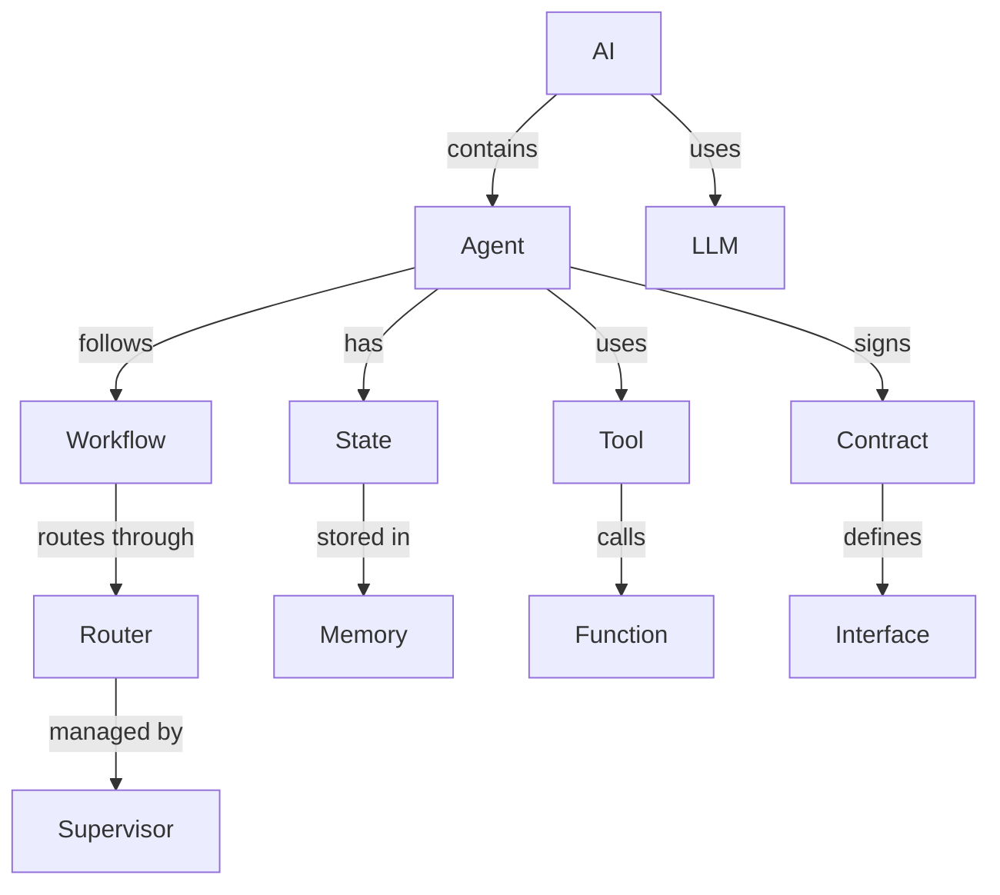

# Chapter 03 - Dictionary

## 1. 核心觀念

### Dictionary = Vocabulary + Context + Mapping

字典（Dictionary）在 AI 代理人系統中扮演著 **知識映射** 和 **術語標準化** 的角色。它不是單純的單字定義，而是：

- **術語集** (Vocabulary): 系統中使用的所有術語
- **語境定義** (Contextual Definition): 術語在特定領域的意義
- **映射關係** (Mapping): 術語之間的關聯和轉換
- **動態更新** (Dynamic Update): 能夠隨著系統演進而更新

### 為什麼需要字典？

沒有字典的系統：
```
Agent 1: "我需要做 research"
Agent 2: "我需要進行 investigation"
Agent 3: "我要收集 information"
# ❌ 同一個概念，三種不同的說法
```

有字典的系統：
```
Dictionary: research = investigation = information gathering
Agent 1: "我需要做 research"
Agent 2: "我需要做 research"  # ✅ 統一術語
Agent 3: "我需要做 research"
```

### 字典的種類

```
┌─────────────────────────────────────────────┐
│              Dictionary Types                   │
├─────────────────────────────────────────────┤
│                                                 │
│  1. 術語字典 (Term Dictionary)                  │
│     └── 定義系統中的專有名詞                     │
│                                                 │
│  2. 同義詞字典 (Synonym Dictionary)              │
│     └── 映射相同概念的不同表達                   │
│                                                 │
│  3. 上下文字典 (Context Dictionary)             │
│     └── 術語在不同情境下的意義                   │
│                                                 │
│  4. 翻譯字典 (Translation Dictionary)           │
│     └── 跨語言術語映射                           │
│                                                 │
│  5. 詞頻字典 (Frequency Dictionary)             │
│     └── 術語使用頻率統計                         │
│                                                 │
└─────────────────────────────────────────────┘
```

### 字典在 AI 代理人中的應用

1. **術語標準化** (Term Standardization)
   - 統一不同代理人、不同使用者的術語
   - 避免溝通上的歧義

2. **知識連結** (Knowledge Linking)
   - 將相關概念連結起來
   - 建立知識圖譜的基礎

3. **語義理解** (Semantic Understanding)
   - 師AI理解術語的深層含義
   - 支持上下文感知的對話

4. **多語言支持** (Multilingual Support)
   - 術語的跨語言映射
   - 支持國際化

## 2. Architecture

### 字典系統架構

```
┌─────────────────────────────────────────────┐
│             Dictionary System                   │
├─────────────────────────────────────────────┤
│                                                     │
│  ┌──────────────┐   ┌──────────────┐         │
│  │  Dictionary   │   │   Indexer     │         │
│  │   Manager    │   │               │         │
│  │               │   │ - Build       │         │
│  │ - add_term() │   │   Index       │         │
│  │ - get_term() │   │ - Search      │         │
│  │ - update()   │   │ - Suggest     │         │
│  │ - search()   │   │               │         │
│  └──────────────┘   └──────────────┘         │
│            ↓                     ↓               │
│  ┌──────────────────────────────────────┐    │
│  │           Dictionary Store             │    │
│  │  - Terminology DB                      │    │
│  │  - Synonym Map                         │    │
│  │  - Context Map                         │    │
│  │  - Translation Map                     │    │
│  └──────────────────────────────────────┘    │
│                                                     │
└─────────────────────────────────────────────┘
```

### 字典資料結構

```
Term Entry:
{
  "term_id": "unique_identifier",
  "term": "Agent",
  "definition": "AI 系統中的自主執行單元",
  "category": "AI Concept",
  "contexts": [
    {
      "domain": "AI Development",
      "meaning": "具備智能、記憶、工具使用能力的自主系統"
    },
    {
      "domain": "General",
      "meaning": "代理人，代表他人行事的人或組織"
    }
  ],
  "synonyms": ["AI Agent", "Intelligent Agent", "代理人"],
  "antonyms": [],
  "related_terms": ["LLM", "Tool", "State", "Workflow"],
  "translations": {
    "en": "Agent",
    "zh-TW": "代理人",
    "ja": "エージェント"
  },
  "usage_examples": [
    "我們需要一個 Planner Agent 來規劃任務",
    "這個 Agent 能夠自主執行研究任務"
  ],
  "frequency": 42,
  "last_updated": "2026-07-15"
}
```

### 術語關係圖



## 3. Python

### 術語類別定義

```python
from dataclasses import dataclass, field
from typing import Dict, List, Optional, Set
from datetime import datetime

@dataclass
class TermContext:
    """術語的上下文定義"""
    domain: str
    meaning: str
    examples: List[str] = field(default_factory=list)

@dataclass
class Term:
    """術語實體"""
    term: str
    definition: str
    category: str
    contexts: List[TermContext] = field(default_factory=list)
    synonyms: List[str] = field(default_factory=list)
    antonyms: List[str] = field(default_factory=list)
    related_terms: List[str] = field(default_factory=list)
    translations: Dict[str, str] = field(default_factory=dict)
    usage_examples: List[str] = field(default_factory=list)
    frequency: int = 0
    tags: List[str] = field(default_factory=list)
    created_at: str = field(default_factory=lambda: datetime.now().isoformat())
    updated_at: str = field(default_factory=lambda: datetime.now().isoformat())
    
    def add_context(self, domain: str, meaning: str, examples: List[str] = None):
        """新增上下文定義"""
        self.contexts.append(TermContext(
            domain=domain,
            meaning=meaning,
            examples=examples or []
        ))
    
    def add_synonym(self, synonym: str):
        """新增同義詞"""
        if synonym not in self.synonyms:
            self.synonyms.append(synonym)
    
    def add_translation(self, lang: str, translation: str):
        """新增翻譯"""
        self.translations[lang] = translation
    
    def to_dict(self) -> Dict:
        """轉為字典"""
        return {
            'term': self.term,
            'definition': self.definition,
            'category': self.category,
            'contexts': [{'domain': c.domain, 'meaning': c.meaning, 'examples': c.examples} 
                        for c in self.contexts],
            'synonyms': self.synonyms,
            'antonyms': self.antonyms,
            'related_terms': self.related_terms,
            'translations': self.translations,
            'usage_examples': self.usage_examples,
            'frequency': self.frequency,
            'tags': self.tags,
            'created_at': self.created_at,
            'updated_at': self.updated_at
        }
```

### 字典管理器

```python
class DictionaryManager:
    """字典管理器 - 管理術語集合"""
    
    def __init__(self):
        self.terms: Dict[str, Term] = {}
        self.synonym_index: Dict[str, str] = {}  # 同義詞 -> 正式術語
        self.category_index: Dict[str, List[str]] = {}  # 分類 -> 術語列表
        self.tag_index: Dict[str, List[str]] = {}  # 標籤 -> 術語列表
        
    def add_term(self, term_data: Dict) -> str:
        """新增術語"""
        term = Term(**term_data)
        
        # 新增術語
        self.terms[term.term] = term
        
        # 更新同義詞索引
        for synonym in term.synonyms:
            self.synonym_index[synonym] = term.term
        
        # 更新分類索引
        if term.category not in self.category_index:
            self.category_index[term.category] = []
        self.category_index[term.category].append(term.term)
        
        # 更新標籤索引
        for tag in term.tags:
            if tag not in self.tag_index:
                self.tag_index[tag] = []
            self.tag_index[tag].append(term.term)
        
        return term.term
    
    def get_term(self, term: str) -> Optional[Term]:
        """獲取術語（支持同義詞查詢）"""
        # 先查正式術語
        if term in self.terms:
            return self.terms[term]
        
        # 再查同義詞
        if term in self.synonym_index:
            formal_term = self.synonym_index[term]
            return self.terms.get(formal_term)
        
        return None
    
    def search(self, query: str, limit: int = 10) -> List[Term]:
        """搜尋術語"""
        results = []
        
        # 精確匹配
        if query in self.terms:
            results.append(self.terms[query])
        
        # 同義詞匹配
        if query in self.synonym_index:
            formal_term = self.synonym_index[query]
            if formal_term not in [r.term for r in results]:
                results.append(self.terms[formal_term])
        
        # 部分匹配（簡單版）
        query_lower = query.lower()
        for term_name, term in self.terms.items():
            if (query_lower in term_name.lower() or 
                any(query_lower in syn.lower() for syn in term.synonyms)):
                if term not in results:
                    results.append(term)
        
        return results[:limit]
    
    def get_by_category(self, category: str) -> List[Term]:
        """按分類獲取術語"""
        term_names = self.category_index.get(category, [])
        return [self.terms[name] for name in term_names]
    
    def get_by_tag(self, tag: str) -> List[Term]:
        """按標籤獲取術語"""
        term_names = self.tag_index.get(tag, [])
        return [self.terms[name] for name in term_names]
    
    def update_term_frequency(self, term: str):
        """更新術語使用頻率"""
        if term in self.terms:
            self.terms[term].frequency += 1
            self.terms[term].updated_at = datetime.now().isoformat()
```

### 字典工具函數

```python
class DictionaryUtils:
    """字典工具函數"""
    
    @staticmethod
    def get_term_in_context(term: str, domain: str, dictionary: DictionaryManager) -> Optional[str]:
        """獲取術語在特定領域的定義"""
        term_obj = dictionary.get_term(term)
        if term_obj:
            for context in term_obj.contexts:
                if context.domain == domain:
                    return context.meaning
        return None
    
    @staticmethod
    def find_synonyms(term: str, dictionary: DictionaryManager) -> List[str]:
        """尋找術語的同義詞"""
        term_obj = dictionary.get_term(term)
        if term_obj:
            return term_obj.synonyms
        return []
    
    @staticmethod
    def normalize_term(term: str, dictionary: DictionaryManager) -> str:
        """標準化術語（轉換為正式術語）"""
        term_obj = dictionary.get_term(term)
        if term_obj:
            return term_obj.term
        return term
    
    @staticmethod
    def get_related_terms(term: str, dictionary: DictionaryManager, max_depth: int = 1) -> Set[str]:
        """獲取相關術語（廣度優先搜索）"""
        term_obj = dictionary.get_term(term)
        if not term_obj:
            return set()
        
        visited = set()
        queue = [term_obj.term]
        results = set()
        
        while queue and max_depth > 0:
            current = queue.pop(0)
            if current in visited:
                continue
            
            visited.add(current)
            current_term = dictionary.get_term(current)
            
            if current_term:
                for related in current_term.related_terms:
                    if related not in visited:
                        results.add(related)
                        queue.append(related)
            
            max_depth -= 1
        
        return results
```

## 4. GitHub Implementation

### 本專案中的字典應用

本專案的字典系統在 [`docs/glossary/Glossary.md`](../glossary/Glossary.md) 中定義了核心術語：

```markdown
# Glossary

## State
- 狀態管理，工作流程的核心概念

## Agent  
- AI 系統中的自主執行單元

## Prompt
- 給 AI 的指令和上下文

## Tool
- 代理人可以使用的外部功能

## Workflow
- 任務的執行流程

## Router
- 任務的路由和分配

## Validator
- 數據和內容的驗證

## Contract
- 代理人間的協議定義

## LLM
- 大型語言模型

## Context
- 上下文，AI 理解問題的背景

## Memory
- 記憶，AI 保存信息的能力

## Supervisor
- 監督者，協調多個代理人的工作
```

### 字典在代碼中的使用

```python
# 範例：在代理人中使用字典進行術語標準化

class PlannerAgent:
    def __init__(self, config, dictionary: DictionaryManager):
        self.config = config
        self.dictionary = dictionary
    
    def execute(self, task):
        # 標準化任務中的術語
        task['title'] = self.dictionary.normalize_term(task.get('title', ''))
        task['description'] = self.dictionary.normalize_term(task.get('description', ''))
        
        # 獲取術語定義
        if 'research' in task.get('description', '').lower():
            research_def = self.dictionary.get_term_in_context('research', 'AI Development')
            print(f"Research in AI context: {research_def}")
        
        # 繼續執行規劃邏輯...
```

## 5. Code Review

### 字典系統最佳實踐

#### ✅ 良好的字典設計

1. **術語唯一性** (Term Uniqueness)
   - 每個概念只有一個正式術語
   - 同義詞映射到正式術語

2. **上下文感知** (Context Awareness)
   - 術語在不同領域有不同定義
   - 支持多語境定義

3. **可擴展性** (Extensibility)
   - 容易新增新術語
   - 支持動態更新

4. **搜索友好** (Search Friendly)
   - 支持模糊搜索
   - 支持同義詞搜索

#### ❌ 待改進的地方

1. **手動維護** (Manual Maintenance)
   - 目前 Glossary.md 是手動維護
   - 建議：建立自動同步機制

2. **術語重覆** (Term Duplication)
   - 部分術語在多個地方定義
   - 建議：集中管理

3. **缺乏上下文** (Lack of Context)
   - Glossary.md 只有簡單定義
   - 建議：新增使用範例和那域信息

## 6. QA

### 常見問題

#### Q: 為什麼需要花時間建立字典？
A: 
- **溝通效率**：減少術語理解上的摩擦
- **知識傳承**：新成員能快速理解專案術語
- **AI 協助**：AI 工具能更好理解專案內容
- **文檔一致性**：所有文檔使用相同的術語

#### Q: 字典和 Glossary 的差異是什麼？
A: 
- **字典 (Dictionary)**: 程式碼層級的術語管理，支持搜索、同義詞映射
- **Glossary**:人類可閱讀的術語集，提供定義和解釋
- 有些：字典是 cytoplasm，Glossary 是 user-facing

#### Q: 字典該包含多少術語？
A: 
- **核心術語**：一定要包含（20-50 個）
- **擴展術語**：常用的術語（50-200 個）  
- **所有術語**：專案中出現的所有專有名詞
- 原則：Enough to be useful, not so much to be overwhelming

#### Q: 如何維護字典的更新？
A: 
1. **自動化**：掃描代碼和文檔，自動提取術語
2. **協作**：讓團隊成員都能貢獻
3. **審核**：定期審核和更新字典
4. **版本控制**：字典也要納入版本控制

## 7. Exercise

### 練習 1: 簡單的詞頻統計

建立一個 `TermFrequencyAnalyzer` 類別，分析文本中的術語使用情況：

```python
class TermFrequencyAnalyzer:
    def __init__(self, dictionary: DictionaryManager):
        self.dictionary = dictionary
    
    def analyze_text(self, text: str) -> Dict[str, int]:
        """
        分析文本中的術語使用頻率
        回傳: {術語: 出現次數}
        """
        # 你的代碼
        pass
    
    def get_terms_by_frequency(self, text: str, top_n: int = 10) -> List[tuple]:
        """
        獲取文本中出現頻率最高的前 N 個術語
        回傳: [(術語, 次數), ...]
        """
        # 你的代碼
        pass
```

### 練習 2: 術語替換工具

建立一個 `TermReplacer` 類別，將文本中的術語標準化：

```python
class TermReplacer:
    def __init__(self, dictionary: DictionaryManager):
        self.dictionary = dictionary
    
    def replace_synonyms(self, text: str) -> str:
        """
        將文本中的同義詞替換為正式術語
        """
        # 提示：需要處理大小寫、單複數等變化
        # 你的代碼
        pass
    
    def expand_abbreviations(self, text: str) -> str:
        """
        將縮寫展開（例如 AI -> Artificial Intelligence）
        需要先定義縮寫詞典
        """
        # 你的代碼
        pass
```

### 練習 3: 字典建立名工具

建立一個輔助建立字典的工具，能夠：
1. 掃描 Python 代碼中的註釋
2. 提取術語和定義
3. 生成字典條目

```python
import ast
import re

class DictionaryBuilder:
    def __init__(self):
        self.patterns = [
            r'#\s*(.+?):\s*(.+)',  # # 術語: 定義
            r'"""\s*(.+?)\s*-\s*(.+?)\s*"""',  # """術語 - 定義"""
        ]
    
    def extract_terms_from_code(self, code: str) -> List[Dict]:
        """
        從 Python 代碼中提取術語
        回傳: [{'term': '...', 'definition': '...'}, ...]
        """
        # 你的代碼
        pass
    
    def extract_terms_from_markdown(self, markdown: str) -> List[Dict]:
        """
        從 Markdown 文件中提取術語
        """
        # 你的代碼
        pass
```

## 8. Reflection

### 學習本章後的思考

1. **字典的價值**
   - 字典是知識的地圖：Dictionary is a map of knowledge
   - 字典是溝通的橋樑：Dictionary is a bridge for communication
   - 字典是 AI 的訓絡師：Dictionary is a teacher for AI

2. **設計見解**
   - 字典要活：Living dictionary, not static document
   - 字典要全：Comprehensive enough to be useful
   - 字典要易用：Easy to access and update

3. **實踐經驗**
   - 字典善從小開始：Start small, grow as needed
   - 字典要集中管理：Centralized management is key
   - 字典要自動化：Automation reduces maintenance burden

4. **未來方向**
   - 字典的智能推薦：Can we suggest terms automatically?
   - 字典的語義分析：Can we understand term relationships?
   - 字典的跨專案共享：Can we share glossaries across projects?

---

**下一章**: [Chapter 04 - Function](04-Function.md)
**上一級**: [../COURSE_CONTEXT.md](../COURSE_CONTEXT.md) | [../ROADMAP.md](../ROADMAP.md)