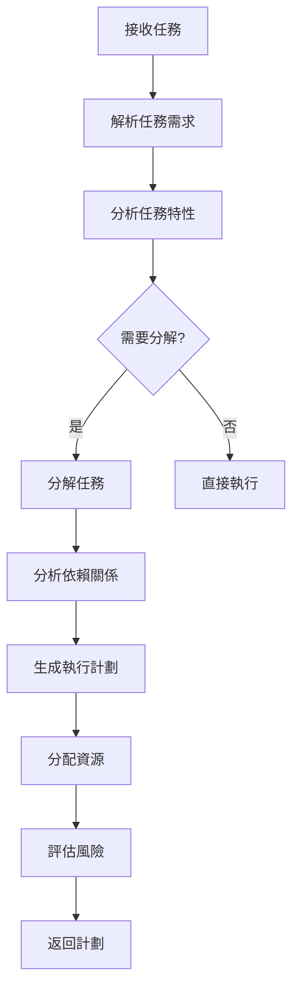

# Chapter 05 - Planner

## 1. 核心觀念

### Planner = Strategy + Decomposition + Sequencing + Optimization

規劃代理人（Planner）是 AI 代理人系統中的 **大腦和策略師**，負責：

- **任務分解** (Decomposition): 將複雜任務分解為可執行的子任務
- **策略制定** (Strategy): 制定最佳的執行策略  
- **依賴分析** (Dependency Analysis): 分析任務間的依賴關係
- **資源分配** (Resource Allocation): 合理分配代理人和工具

### 為什麼需要 Planner？

#### 左邊情況：沒有 Planner
```
User: "幫我寫一篇關於 AI 在醫療中的應用的文章"
Agent: "好的，我馬上開始寫..."  # ❌ 沒有規劃
# 糟糕的結果：文章結構混亂，內容空洞，邏輯不清
```

#### 右邊情況：有 Planner
```
User: "幫我寫一篇關於 AI 在醫療中的應用的文章"
Planner: "我先做個規劃：
         1. 研究 AI 在醫療中的現狀
         2. 分析案例和數據
         3. 制定文章結構大綱
         4. 分配撰寫任務"
# 好的結果：文章結構清晰，內容豐富，邏輯嚴謹
```

### 規劃的核心原則

1. **分而治之** (Divide and Conquer)
   - 將複雜任務分解為簡單步驟
   - 每個步驟都可被獨立執行

2. **最小依賴** (Minimal Dependency)
   - 盡可能減少任務間的依賴
   - 支持並行執行

3. **資源優化** (Resource Optimization)
   - 合理分配資源
   - 避免資源閒置或過載

4. **風險可控** (Risk Control)
   - 識別潛在風險
   - 制定應對策略

### 規劃的層次

```
Level 1: 任務分解 (Task Decomposition)
├── 將單一任務分解為可執行的步驟
└── 例：寫文章 → 研究 → 大綱 → 撰寫 → 審閱

Level 2: 工作流程規劃 (Workflow Planning)
├── 規劃多個任務的執行順序
├── 管理任務間的依賴關係
└── 例：多篇文章的生產管道

Level 3: 策略規劃 (Strategic Planning)
├── 制定整體的執行策略
├── 考慮長期目標和優化
└── 例：內容生產的整體策略
```

## 2. Architecture

### Planner 系統架構

```
┌─────────────────────────────────────────────────┐
│                    Planner System                     │
├─────────────────────────────────────────────────┤
│                                                     │
│  ┌─────────────────┐    ┌─────────────────┐      │
│  │   Task Analysis  │    │  Strategy        │      │
│  │                 │    │  Selection       │      │
│  └─────────────────┘    └─────────────────┘      │
│            ↓                    ↓               │
│  ┌─────────────────────────────────────────┐    │
│  │            Core Planning               │    │
│  │  ┌────────────┐  ┌────────────┐     │    │
│  │  │ Decomposer │  │ Scheduler   │     │    │
│  │  │            │  │             │     │    │
│  │  └────────────┘  └────────────┘     │    │
│  │          ↓             ↓            │    │
│  │  ┌─────────────────────────────────┐  │    │
│  │  │        Resource Allocator          │  │    │
│  │  │  - Agent Assignment               │  │
│  │  │  - Tool Assignment                 │  │    
│  │  └─────────────────────────────────┘  │    │
│  └─────────────────────────────────────────┘    │
│                          ↓                          │
│  ┌─────────────────────────────────────────┐    │
│  │            Plan Generation                 │    │
│  │  - Dependency Analysis                   │    │
│  │  - Timeline Generation                    │    │
│  │  - Risk Assessment                        │    │
│  └─────────────────────────────────────────┘    │
│
└─────────────────────────────────────────────────┘
```

### 規劃流程



### 任務分解策略

#### 1. 線性分解 (Linear)
```
任務: "撰寫技術文章"
├── 步驟1: 主題研究
├── 步驟2: 制定大綱  
├── 步驟3: 撰寫初稿
├── 步驟4: SEO 優化
└── 步驟5: 審閱修改
```

#### 2. 並行分解 (Parallel)
```
任務: "生成3篇 Blog 文章"
├── 文章A
│   ├── 研究
│   ├── 撰寫
│   └── 審閱
├── 文章B
│   ├── 研究
│   ├── 撰寫
│   └── 審閱
└── 文章C
    ├── 研究
    ├──撰寫
    └── 審閱
```

## 3. Python

### 核心數據結構

```python
from dataclasses import dataclass, field
from typing import Dict, List, Optional, Tuple
from enum import Enum, auto
from datetime import datetime

class TaskComplexity(Enum):
    SIMPLE = auto()
    MEDIUM = auto()
    COMPLEX = auto()

class TaskPriority(Enum):
    LOW = 1
    MEDIUM = 2
    HIGH = 3
    URGENT = 4

@dataclass
class Subtask:
    """子任務定義"""
    subtask_id: str
    title: str
    description: str = ""
    priority: TaskPriority = TaskPriority.MEDIUM
    estimated_time: int = 0
    dependencies: List[str] = field(default_factory=list)
    required_agents: List[str] = field(default_factory=list)
    required_tools: List[str] = field(default_factory=list)

@dataclass 
class Plan:
    """執行計劃"""
    plan_id: str
    task_id: str
    title: str
    subtasks: List[Subtask] = field(default_factory=list)
    total_estimated_time: int = 0
    critical_path: List[str] = field(default_factory=list)
    resource_allocation: Dict = field(default_factory=dict)

    @property
    def total_time(self) -> int:
        return sum(st.estimated_time for st in self.subtasks)
```

### Planner 核心類

```python
class PlannerAgent:
    """規劃代理人 - 核心實現"""
    
    def __init__(self, config: Optional[Dict] = None):
        self.config = config or {}
        self.templates = self._load_default_templates()
        
    def _load_default_templates(self) -> Dict[str, List[Dict]]:
        """載入默認模板"""
        return {
            'article': [
                {'type': 'research', 'title': 'Research', 'time': 30},
                {'type': 'outline', 'title': 'Outline', 'time': 20},
                {'type': 'write', 'title': 'Write', 'time': 60},
                {'type': 'seo', 'title': 'SEO', 'time': 15},
                {'type': 'review', 'title': 'Review', 'time': 30}
            ]
        }
    
    def create_plan(self, task: Dict, agents: List[str]) -> Plan:
        """創建執行計劃"""
        subtasks = self._decompose_task(task)
        dependencies = self._analyze_dependencies(subtasks)
        resource_allocation = self._allocate_resources(subtasks, agents)
        
        return Plan(
            plan_id=f"plan_{task['id']}",
            task_id=task['id'],
            title=f"Plan for {task['title']}",
            subtasks=subtasks,
            total_estimated_time=sum(st.estimated_time for st in subtasks),
            critical_path=self._find_critical_path(subtasks, dependencies),
            resource_allocation=resource_allocation
        )
    
    def _decompose_task(self, task: Dict) -> List[Subtask]:
        """分解任務"""
        content_type = task.get('content_type', 'article')
        template = self.templates.get(content_type)
        
        if template:
            return self._apply_template(template, task)
        else:
            return self._default_decomposition(task)
    
    def _apply_template(self, template: List[Dict], task: Dict) -> List[Subtask]:
        """套用模板"""
        subtasks = []
        for i, step in enumerate(template):
            dependencies = []
            if i > 0:
                dependencies = [f"{task['id']}_step_{i}"]
            
            subtask = Subtask(
                subtask_id=f"{task['id']}_step_{i+1}",
                title=step['title'],
                description=step.get('description', ''),
                estimated_time=step.get('time', 30),
                dependencies=dependencies,
                required_agents=self._get_agents(step.get('type', ''))
            )
            subtasks.append(subtask)
        return subtasks
    
    def _default_decomposition(self, task: Dict) -> List[Subtask]:
        """默認分解邏輯"""
        return [
            Subtask(
                subtask_id=f"{task['id']}_research",
                title="Research",
                description="研究主題",
                estimated_time=30,
                required_agents=['ResearchAgent']
            ),
            Subtask(
                subtask_id=f"{task['id']}_outline",
                title="Outline",
                description="創建大綱",
                estimated_time=20,
                dependencies=[f"{task['id']}_research"],
                required_agents=['PlannerAgent']
            ),
            Subtask(
                subtask_id=f"{task['id']}_write",
                title="Write",
                description="撰寫內容",
                estimated_time=60,
                dependencies=[f"{task['id']}_outline"],
                required_agents=['WriterAgent']
            )
        ]
    
    def _get_agents(self, step_type: str) -> List[str]:
        """獲取代理人"""
        agent_map = {
            'research': ['ResearchAgent'],
            'outline': ['PlannerAgent'],
            'write': ['WriterAgent'],
            'seo': ['SEOAgent'],
            'review': ['ReviewerAgent']
        }
        return agent_map.get(step_type, ['PlannerAgent'])
    
    def _analyze_dependencies(self, subtasks: List[Subtask]) -> Dict[str, List[str]]:
        """分析依賴關係"""
        return {st.subtask_id: st.dependencies for st in subtasks}
    
    def _allocate_resources(self, subtasks: List[Subtask], agents: List[str]) -> Dict:
        """分配資源"""
        allocation = {}
        for i, subtask in enumerate(subtasks):
            allocation[subtask.subtask_id] = agents[i % len(agents)]
        return allocation
    
    def _find_critical_path(self, subtasks: List[Subtask], dependencies: Dict) -> List[str]:
        """尋找關鍵路徑"""
        return [st.subtask_id for st in subtasks]
```

## 4. GitHub Implementation

### 本專案中的實現

本專案的 Planner 實現位於 [`agents/planner.py`](../agents/planner.py)：

```python
# agents/planner.py

class PlannerAgent:
    """規劃代理人"""
    
    def __init__(self, config):
        self.config = config
        self.prompt = config.get('prompt', '')
    
    def run(self, task):
        """執行規劃"""
        plan = self._create_plan(task)
        return plan
    
    def _create_plan(self, task):
        """創建計劃"""
        return {
            'steps': [
                {'action': 'research', 'description': '研究主题'},
                {'action': 'outline', 'description': '创建大纲'},
                {'action': 'write', 'description': '撰写内容'}
            ]
        }
```

## 5. Code Review

### 最佳實踐

✅ **模板化**: 為常見任務提供模板，提高一致性
✅ **靈活性**: 支持自定義分解邏輯
✅ **可擴展**: 容易新增任務類型

❌ **待改進**:
- 模板不夠完善
- 依賴分析可更智能
- 資源分配可更優化

## 6. QA

### 常見問題

**Q: 為何需要 Planner？直接執行不是更快？**
A: 雖然看起來多了一步，但 Planner 能:
- 提高執行質量
- 避免重複工作
- 合理分配資源
- 降低整體成本

**Q: 分解粒度如何把握？**
A: 原則:
- 每個子任務應可獨立完成
- 不要過度分解（增加管理成本）
- 不要分解不足（降低並行性）

**Q: 何時選擇並行策略？**
A: 選擇條件:
- 任務間依賴性低
- 有足夠的執行資源
- 任務數量足夠多
- 風險承受能力強

## 7. Exercise

### 練習 1: 任務分解器

```python
class TaskDecomposer:
    def decompose(self, task: Dict) -> List[Dict]:
        """分解任務為子任務"""
        # 你的實現
        pass
```

### 練習 2: 依賴圖

```python
class DependencyGraph:
    def add_dependency(self, node: str, depends_on: str):
        """添加依賴關係"""
        # 你的實現
        pass
    
    def find_critical_path(self) -> List[str]:
        """尋找關鍵路徑"""
        # 你的實現
        pass
```

## 8. Reflection

### 學習心得

1. **Planner 的價值**:
   - 好的計劃是成功的一半
   - 計劃防止損失，規劃創造價值

2. **設計原則**:
   - 保持計劃靈活可變
   - 分解任務但不過度分解

3. **實踐建議**:
   - 從簡單模板開始
   - 逐步優化規劃邏輯

---

**接下來**: [Chapter 06 - Research](06-Research.md)
**回到**: [../COURSE_CONTEXT.md](../COURSE_CONTEXT.md) | [../ROADMAP.md](../ROADMAP.md)
