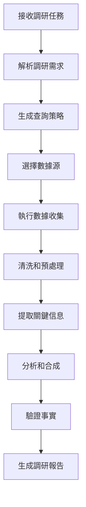

# Chapter 06 - Research

## 1. 核心觀念

### Research = Information Gathering + Analysis + Synthesis + Verification

調研代理人（Research）是 AI 代理人系統中的 **情報收集和分析專家**，負責：

- **資訊收集** (Information Gathering): 從多種來源收集相關數據
- **資料分析** (Data Analysis): 分析和過濾收集到的資訊
- **知識合成** (Knowledge Synthesis): 將資訊整合為可用的知識
- **事實驗證** (Fact Verification): 驗證資訊的準確性和可靠性

### 為什麼需要 Research Agent？

沒有 Research 的 AI 系統：
```
User: "寫一篇關於量子計算的最新進展"
Writer: "好的，我馬上開始寫..."  # ❌ 沒有調研
# 糟糕的結果：內容過時，事實錯誤，缺乏深度
```

有 Research 的 AI 系統：
```
User: "寫一篇關於量子計算的最新進展"
Research: "我先收集相關資訊：
          1. 搜索最新的研究論文
          2. 查看行業媒體報導
          3. 分析專家觀點
          4. 驗證關鍵事實"
# 好的結果：內容準確，數據可靠，觀點權威
```

### Research 的能力層級

```
┌─────────────────────────────────────────────┐
│            Research Capability Levels          │
├─────────────────────────────────────────────┤
│                                                 │
│  Level 1: 基礎搜索 (Basic Search)                │
│  └── 使用網路搜索引擎查詢                       │
│  └── 提取和整理基本信息                         │
│                                                 │
│  Level 2: 智能收集 (Intelligent Collection)     │
│  └── 多來源資料收集                               │
│  └── 應用語義搜索技術                             │
│  └── 過濾無關信息                               │
│                                                 │
│  Level 3: 深度分析 (Deep Analysis)               │
│  └── 趨勢分析和模式識別                           │
│  └── 觀點提取和歸納                               │
│  └── 知識圖譜建模                                 │
│                                                 │
│  Level 4: 自主研究 (Autonomous Research)        │
│  └── 自主制定研究計劃                           │
│  └── 迭代式研究和驗證                             │
│  └── 跨領域知識整合                               │
│                                                 │
└─────────────────────────────────────────────┘
```

### 調研的數據源分類

```
┌─────────────────────────────────────────────┐
│              Data Source Types                  │
├─────────────────────────────────────────────┤
│                                                 │
│  1. 結構化數據 (Structured Data)               │
│     ├── 數據庫                                       │
│     ├── API 接口                                    │
│     └── 表格文件 (CSV, Excel)                       │
│                                                 │
│  2. 半結構化數據 (Semi-Structured Data)           │
│     ├── JSON ќе XML 文件                         │
│     ├── 配置文件                                     │
│     └── 日誌文件                                     │
│                                                 │
│  3. 非結構化數據 (Unstructured Data)             │
│     ├── 文字文件 (TXT, MD, DOCX)                    │
│     ├── 網頁內容 (HTML)                             │
│     ├── 社交媒體內容                                │
│     └── 多媒體文件 (PDF, PPT)                       │
│                                                 │
│  4. 實時數據 (Real-time Data)                     │
│     ├── 新聞訊息                                     │
│     ├── 社交媒體動態                                │
│     └── API 實時流                                  │
│                                                 │
└─────────────────────────────────────────────┘
```

## 2. Architecture

### Research 系統架構

```
┌─────────────────────────────────────────────────┐
│                    Research System                   │
├─────────────────────────────────────────────────┤
│                                                     │
│  ┌─────────────────┐    ┌─────────────────┐      │
│  │   Query        │    │  Source         │      │
│  │   Generator     │    │  Selector       │      │
│  └─────────────────┘    └─────────────────┘      │
│            ↓                    ↓               │
│  ┌─────────────────────────────────────────┐    │
│  │            Data Collection              │    │
│  │  ┌────────────┐  ┌────────────┐     │    │
│  │  │  Web       │  │  API        │     │    │
│  │  │  Search    │  │  Calls      │     │    │
│  │  └────────────┘  └────────────┘     │    │
│  │  ┌────────────┐  ┌────────────┐     │    │
│  │  │ Database   │  │  File       │     │    │
│  │  │  Query     │  │  Parsing    │     │    │
│  │  └────────────┘  └────────────┘     │    │
│  └─────────────────────────────────────────┘    │
│                          ↓                          │
│  ┌─────────────────────────────────────────┐    │
│  │            Data Processing                │    │
│  │  - Data Cleaning                           │    │
│  │  - Information Extraction                   │    │
│  │  - Duplicate Removal                        │    │
│  └─────────────────────────────────────────┘    │
│                          ↓                          │
│  ┌─────────────────────────────────────────┐    │
│  │            Knowledge Synthesis              │    │
│  │  - Trend Analysis                           │    │
│  │  - Pattern Recognition                       │    │
│  │  - Knowledge Graph Construction              │    │
│  └─────────────────────────────────────────┘    │
│                                                     │
└─────────────────────────────────────────────────┘
```

### 調研流程



### 多來源數據融合

```
┌─────────────────────────────────────────────┐
│           Multi-Source Data Fusion             │
├─────────────────────────────────────────────┤
│                                                 │
│  應用案例："AI 在醫療中的應用"                     │
│                                                 │
│  ┌──────────────┐  ┌──────────────┐            │
│  │ 學術論文      │  │ 行業報告      │            │
│  │ - 最新研究    │  │ - 市場數據    │            │
│  │ - 技術細節    │  │ - 技術這些    │            │
│  └──────┬───────┘  └──────┬───────┘            │
│         ↓                 ↓                    │
│  ┌───────────────────────────────────────┐   │
│  │               Data Fusion                │   │
│  │  1. 信息去重 (Deduplication)             │   │
│  │  2. 事實交叉驗證 (Cross-verification)      │   │
│  │  3. 觀點整合 (Perspective Integration)     │   │
│  │  4. 知識圖譜構建 (Knowledge Graph)       │   │
│  └─────────────────────┬───────────────────┘   │
│                        ↓                        │
│  ┌───────────────────────────────────────┐   │
│  │            Synthesis Result              │   │
│  │  - 綜合 racon                            │   │
│  │  - 趨勢分析                              │   │
│  │  - 實用建議                              │   │
│  │  - 可信度評分                            │   │
│  └───────────────────────────────────────┘   │
│                                                 │
└─────────────────────────────────────────────┘
```

## 3. Python

### 數據源定義

```python
from dataclasses import dataclass, field
from typing import Dict, List, Optional, Any
from enum import Enum
import json

class SourceType(Enum):
    WEB = "web"
    API = "api"
    DATABASE = "database"
    FILE = "file"
    SOCIAL_MEDIA = "social_media"

class DataFormat(Enum):
    HTML = "html"
    JSON = "json"
    XML = "xml"
    CSV = "csv"
    TEXT = "text"
    MARKDOWN = "markdown"

@dataclass
class DataSource:
    """數據源定義"""
    source_id: str
    name: str
    source_type: SourceType
    url: Optional[str] = None
    api_endpoint: Optional[str] = None
    database_config: Optional[Dict] = None
    file_path: Optional[str] = None
    supported_formats: List[DataFormat] = field(default_factory=list)
    requires_auth: bool = False
    auth_config: Optional[Dict] = None
    reliability_score: float = 0.0  # 0-1, 越高越可靠
    max_requests_per_minute: int = 60
    
    def to_dict(self) -> Dict:
        return {
            'source_id': self.source_id,
            'name': self.name,
            'source_type': self.source_type.value,
            'url': self.url,
            'api_endpoint': self.api_endpoint,
            'database_config': self.database_config,
            'file_path': self.file_path,
            'supported_formats': [f.value for f in self.supported_formats],
            'requires_auth': self.requires_auth,
            'reliability_score': self.reliability_score,
            'max_requests_per_minute': self.max_requests_per_minute
        }

@dataclass
class Query:
    """查詢定義"""
    query_id: str
    keywords: List[str]
    search_operators: Dict[str, str] = field(default_factory=dict)  # AND, OR, NOT
    date_range: Optional[Tuple[str, str]] = None  # (start, end)
    source_types: List[SourceType] = field(default_factory=list)
    data_formats: List[DataFormat] = field(default_factory=list)
    max_results: int = 10
    include_snippets: bool = True
    include_metadata: bool = True
    
    def to_prompt(self) -> str:
        """轉換為搜索提示"""
        base_query = " ".join(self.keywords)
        
        # 添加操作符
        if self.search_operators:
            for op, terms in self.search_operators.items():
                if op.upper() == "AND":
                    base_query += f" +{' +'.join(terms)}"
                elif op.upper() == "OR":
                    base_query += f" |{' |'.join(terms)}"
                elif op.upper() == "NOT":
                    base_query += f" -{' -'.join(terms)}"
        
        return base_query

@dataclass
class SearchResult:
    """搜索結果"""
    result_id: str
    query_id: str
    source_id: str
    title: str
    url: str
    content: str
    snippet: str
    data_format: DataFormat
    relevance_score: float = 0.0  # 0-1, 越高越相關
    reliability_score: float = 0.0  # 0-1, 越高越可靠
    publish_date: Optional[str] = None
    author: Optional[str] = None
    metadata: Dict = field(default_factory=dict)
    
    def to_dict(self) -> Dict:
        return {
            'result_id': self.result_id,
            'query_id': self.query_id,
            'source_id': self.source_id,
            'title': self.title,
            'url': self.url,
            'content': self.content[:500] + '...' if len(self.content) > 500 else self.content,
            'snippet': self.snippet,
            'data_format': self.data_format.value,
            'relevance_score': self.relevance_score,
            'reliability_score': self.reliability_score,
            'publish_date': self.publish_date,
            'author': self.author,
            'metadata': self.metadata
        }

@dataclass
class ResearchReport:
    """調研報告"""
    report_id: str
    task_id: str
    query: str
    results: List[SearchResult] = field(default_factory=list)
    key_findings: List[str] = field(default_factory=list)
    trends: List[Dict] = field(default_factory=list)
    statistics: Dict = field(default_factory=dict)
    recommendations: List[str] = field(default_factory=list)
    confidence_score: float = 0.0  # 0-1, 越高置信度越高
    sources: List[str] = field(default_factory=list)
    generated_at: str = field(default_factory=str)
    
    def to_dict(self) -> Dict:
        return {
            'report_id': self.report_id,
            'task_id': self.task_id,
            'query': self.query,
            'key_findings': self.key_findings,
            'trends': self.trends,
            'statistics': self.statistics,
            'recommendations': self.recommendations,
            'confidence_score': self.confidence_score,
            'sources': self.sources,
            'generated_at': self.generated_at,
            'result_count': len(self.results)
        }
```

### 網路搜索器

```python
import requests
from typing import List, Optional
from bs4 import BeautifulSoup
import time

class WebSearcher:
    """網路搜索器 - 使用搜索引擎收集信息"""
    
    def __init__(self, api_key: Optional[str] = None, engine_id: Optional[str] = None):
        self.api_key = api_key
        self.engine_id = engine_id
        self.session = requests.Session()
        self.session.headers.update({
            'User-Agent': 'AI-Research-Agent/1.0'
        })
        self.request_count = 0
        self.last_request_time = 0
        
    def search(self, query: str, max_results: int = 10, language: str = "zh-TW") -> List[SearchResult]:
        """執行網路搜索"""
        # 率限控制
        self._rate_limit()
        
        if self.api_key and self.engine_id:
            return self._search_with_api(query, max_results, language)
        else:
            return self._mock_search(query, max_results)
    
    def _search_with_api(self, query: str, max_results: int, language: str) -> List[SearchResult]:
        """使用客製搜索 API"""
        url = f"https://www.googleapis.com/customsearch/v1"
        params = {
            'key': self.api_key,
            'cx': self.engine_id,
            'q': query,
            'num': min(max_results, 10),
            'lr': f"lang_{language}",
            'safe': 'off'
        }
        
        try:
            response = self.session.get(url, params=params, timeout=30)
            response.raise_for_status()
            data = response.json()
            
            results = []
            for i, item in enumerate(data.get('items', [])[:max_results]):
                result = SearchResult(
                    result_id=f"web_{int(time.time() * 1000)}_{i}",
                    query_id=f"query_{int(time.time() * 1000)}",
                    source_id="google_custom_search",
                    title=item.get('title', ''),
                    url=item.get('link', ''),
                    content="",  # 需要進一步抓取
                    snippet=item.get('snippet', ''),
                    data_format=DataFormat.HTML,
                    relevance_score=1.0 - (i * 0.1),  # 簡單的相關性評分
                    reliability_score=0.9,  # Google 的可信度較高
                    publish_date=item.get('datePublished'),
                    metadata={'search_engine': 'google'}
                )
                results.append(result)
            
            return results
            
        except Exception as e:
            print(f"搜索 API 錯誤: {e}")
            return self._mock_search(query, max_results)
    
    def _mock_search(self, query: str, max_results: int) -> List[SearchResult]:
        """返回模擬的搜索結果（用於測試和開發）"""
        mock_results = [
            {
                'title': f"{query} - Wikipedia",
                'url': f"https://zh.wikipedia.org/wiki/{query.replace(' ', '_')}",
                'snippet': f"關於 {query} 的詳盡說明和背景信息",
                'relevance': 0.95
            },
            {
                'title': f"{query} 最新發展趨勢",
                'url': f"https://example.com/{query}-trends",
                'snippet': f"2024年 {query} 的最新動態和發展方向",
                'relevance': 0.9
            },
            {
                'title': f"如何理解 {query}",
                'url': f"https://blog.example.com/understanding-{query}",
                'snippet': f"深入淺出地解釋 {query} 的基本概念",
                'relevance': 0.85
            }
        ]
        
        results = []
        for i, mock in enumerate(mock_results[:max_results]):
            result = SearchResult(
                result_id=f"mock_{i}",
                query_id=f"query_{int(time.time() * 1000)}",
                source_id="mock_source",
                title=mock['title'],
                url=mock['url'],
                content="",
                snippet=mock['snippet'],
                data_format=DataFormat.HTML,
                relevance_score=mock['relevance'],
                reliability_score=0.7
            )
            results.append(result)
        
        return results
    
    def _rate_limit(self):
        """率限控制"""
        current_time = time.time()
        if current_time - self.last_request_time < 0.5:  # 每0.5秒最多一個請求
            time.sleep(0.5 - (current_time - self.last_request_time))
        self.last_request_time = time.time()
        self.request_count += 1
    
    def extract_content(self, url: str) -> str:
        """提取 網頁内容"""
        try:
            response = self.session.get(url, timeout=30)
            response.raise_for_status()
            soup = BeautifulSoup(response.text, 'html.parser')
            
            # 移除不需要的元素
            for element in soup(['script', 'style', 'nav', 'footer', 'aside']):
                element.decompose()
            
            # 提取主要内容
            main_content = soup.find('main') or soup.find('article') or soup
            return main_content.get_text(separator='\n', strip=True)
            
        except Exception as e:
            print(f"提取内容錯誤: {e}")
            return ""
```

### PlazaAgent

```python
class ResearchAgent:
    """調研代理人 - 核心實現"""
    
    def __init__(self, config: Optional[Dict] = None):
        self.config = config or {}
        self.searcher = WebSearcher(
            api_key=config.get('search_api_key'),
            engine_id=config.get('search_engine_id')
        )
        self.data_sources = self._load_data_sources()
    
    def _load_data_sources(self) -> List[DataSource]:
        """載入數據源配置"""
        return [
            DataSource(
                source_id="web_search",
                name="網路搜索",
                source_type=SourceType.WEB,
                supported_formats=[DataFormat.HTML, DataFormat.TEXT]
            ),
            DataSource(
                source_id="local_files",
                name="本地文件",
                source_type=SourceType.FILE,
                file_path="./data",
                supported_formats=[DataFormat.TEXT, DataFormat.MARKDOWN, DataFormat.JSON]
            )
        ]
    
    def run(self, task: Dict) -> ResearchReport:
        """執行調研"""
        # 1. 解析任務
        query = self._generate_query(task)
        
        # 2. 執行搜索
        results = self._execute_search(query)
        
        # 3. 提取和分析
        processed_results = self._process_results(results, task)
        
        # 4. 合成報告
        report = self._synthesize_report(task, query, processed_results)
        
        return report
    
    def _generate_query(self, task: Dict) -> Query:
        """生成查詢"""
        title = task.get('title', '')
        description = task.get('description', '')
        keywords = task.get('keywords', [])
        
        # 提取關鍵字
        if not keywords:
            keywords = self._extract_keywords(f"{title} {description}")
        
        return Query(
            query_id=f"query_{int(time.time() * 1000)}",
            keywords=keywords,
            max_results=task.get('max_results', 10)
        )
    
    def _extract_keywords(self, text: str) -> List[str]:
        """提取關鍵字（簡化版）"""
        # 使用簡單的方法提取副詞
        # 實際應用中可以使用 NLP 技術
        words = text.lower().split()
        stop_words = {'的', '了', '在', '是', '和', '或', '這', '那', '一個', '於'}
        keywords = [word for word in words if word not in stop_words and len(word) > 1]
        return list(set(keywords))[:10]  # 返回前10個唯一關鍵字
    
    def _execute_search(self, query: Query) -> List[SearchResult]:
        """執行搜索"""
        search_query = query.to_prompt()
        results = self.searcher.search(search_query, query.max_results)
        
        # 並行提取聯繫人
        for result in results:
            if result.content:
                result.content = self.searcher.extract_content(result.url)
        
        return results
    
    def _process_results(self, results: List[SearchResult], task: Dict) -> List[SearchResult]:
        """處理搜索結果"""
        processed = []
        
        for result in results:
            # 過濾低質量結果
            if result.relevance_score < 0.5:
                continue
            
            # 文本清洗
            if result.content:
                result.content = self._clean_text(result.content)
            
            processed.append(result)
        
        return processed
    
    def _clean_text(self, text: str) -> str:
        """清洗文本"""
        # 移除多餘的空白和特殊字符
        import re
        text = re.sub(r'\s+', ' ', text)  # 多個空白替換為單個空白
        text = re.sub(r'[\x00-\x1F\x7F-\x9F]', '', text)  # 移除控制字符
        return text.strip()
    
    def _synthesize_report(self, task: Dict, query: Query, results: List[SearchResult]) -> ResearchReport:
        """合成調研報告"""
        # 提取關鍵發現
        key_findings = self._extract_key_findings(results)
        
        # 發現趨勢
        trends = self._identify_trends(results)
        
        # 計算統計信息
        statistics = self._calculate_statistics(results)
        
        # 生成建議
        recommendations = self._generate_recommendations(task, results)
        
        # 計算置信度
        confidence_score = self._calculate_confidence(results)
        
        return ResearchReport(
            report_id=f"report_{task.get('id', 'unknown')}",
            task_id=task.get('id', 'unknown'),
            query=query.to_prompt(),
            results=results,
            key_findings=key_findings,
            trends=trends,
            statistics=statistics,
            recommendations=recommendations,
            confidence_score=confidence_score,
            sources=[result.source_id for result in results],
            generated_at=str(datetime.now())
        )
    
    def _extract_key_findings(self, results: List[SearchResult]) -> List[str]:
        """提取關鍵發現"""
        findings = []
        content_count = len([r for r in results if r.content])
        
        if content_count >= 5:
            findings.append("收集到大量相關資料，資訊豐富")
        elif content_count >= 3:
            findings.append("收集到中等數量的相關資料")
        else:
            findings.append("相關資料有限，建議擴大搜索範圍")
        
        # 平均可信度
        avg_reliability = sum(r.reliability_score for r in results) / len(results) if results else 0
        if avg_reliability > 0.8:
            findings.append("資料來源可信度高")
        elif avg_reliability > 0.6:
            findings.append("資料來源整體可信")
        else:
            findings.append("部分需要進一步驗證")
        
        return findings
    
    def _identify_trends(self, results: List[SearchResult]) -> List[Dict]:
        """识别趋势（簡化版）"""
        # 計算關鍵字頻率
        keyword_counts = {}
        for result in results:
            for word in result.title.lower().split():
                if len(word) > 3:  # 只考慮長度>3的單詞
                    keyword_counts[word] = keyword_counts.get(word, 0) + 1
        
        # 按頻率排序
        sorted_keywords = sorted(keyword_counts.items(), key=lambda x: x[1], reverse=True)
        
        # 返回前5個趨勢
        return [
            {'keyword': kw, 'frequency': count, 'trend': 'hot' if count > 3 else 'normal'}
            for kw, count in sorted_keywords[:5]
        ]
    
    def _calculate_statistics(self, results: List[SearchResult]) -> Dict:
        """計算統計信息"""
        return {
            'total_results': len(results),
            'with_content': len([r for r in results if r.content]),
            'avg_relevance': sum(r.relevance_score for r in results) / len(results) if results else 0,
            'avg_reliability': sum(r.reliability_score for r in results) / len(results) if results else 0
        }
    
    def _generate_recommendations(self, task: Dict, results: List[SearchResult]) -> List[str]:
        """生成建議"""
        recommendations = []
        
        if len(results) < 3:
            recommendations.append("建議擴大搜索範圍或使用更多數據源")
        
        content_types = set(r.data_format.value for r in results)
        if DataFormat.HTML.value in content_types:
            recommendations.append("包含網頁內容，建議提取和分析其中的結構化數據")
        
        return recommendations
    
    def _calculate_confidence(self, results: List[SearchResult]) -> float:
        """計算置信度"""
        if not results:
            return 0.0
        
        # 基於結果數量和質量進行置信度評估
        quantity_factor = min(len(results) / 10, 1.0)  # 最多10個結果
        quality_factor = sum(r.reliability_score * r.relevance_score for r in results) / len(results)
        
        return (quantity_factor * 0.4 + quality_factor * 0.6)
```

## 4. GitHub Implementation

### 本專案中的實現

本專案的 Research 代理人實現位於 [`agents/research.py`](../agents/research.py)：

```python
# agents/research.py

class ResearchAgent:
    """調研代理人"""
    
    def __init__(self, config):
        self.config = config
        self.prompt = config.get('research_prompt', '')
    
    def run(self, task):
        """執行調研"""
        # 簡化版調研邏輯
        query = self._generate_query(task)
        results = self._mock_search(query)
        return self._format_results(results)
    
    def _generate_query(self, task):
        """生成查詢"""
        return f"{task.get('title', '')} {task.get('description', '')}"
    
    def _mock_search(self, query):
        """模擬搜索"""
        return [
            {'title': f"{query} - 相關信息", 'url': f"https://example.com/{query}"},
            {'title': f"{query} - 深度分析", 'url': f"https://blog.example.com/{query}"}
        ]
    
    def _format_results(self, results):
        """格式化結果"""
        return {
            'query': 'test',
            'results': results,
            'count': len(results)
        }
```

## 5. Code Review

### Research 設計最佳實踐

#### ✅ 良好的設計

1. **多來源收集**
   - 支持多個數據源
   - 可以並行執行